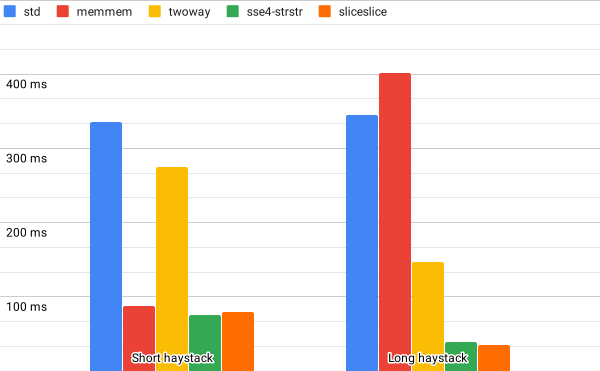

# sliceslice

[](https://github.com/cloudflare/sliceslice-rs/actions)
[](https://crates.io/crates/sliceslice)
[](https://docs.rs/sliceslice)
[](LICENSE)

A fast implementation of single-pattern substring search using SIMD acceleration, based on the work [presented by Wojciech Muła](http://0x80.pl/articles/simd-strfind.html). For a fast multi-pattern substring search algorithm, see instead the [`aho-corasick` crate](https://github.com/BurntSushi/aho-corasick).

## Example

```rust
use sliceslice::x86::DynamicAvx2Searcher;

fn main() {
    let searcher = unsafe { DynamicAvx2Searcher::new(b"ipsum".to_owned().into()) };

    assert!(unsafe {
        searcher.search_in(b"Lorem ipsum dolor sit amet, consectetur adipiscing elit")
    });

    assert!(!unsafe {
        searcher.search_in(b"foo bar baz qux quux quuz corge grault garply waldo fred")
    });
}
```

## Benchmarks

We ran the **[`i386` benchmarks](bench/benches/i386.rs)** on an **HP EliteDesk 800 G2 Tower PC** with an **Intel Core i7-6700 Processor @ 3.40GHz**, **16GB of RAM** and **512GB** of disk space, running **Ubuntu 20.04.1 LTS**, **gcc 9.3.0** and **Rust 1.46.0**.

| **Library**                                                   | **Version**   | **Function**                                                                                                                           | **Short haystack**                  | **Long haystack**                   |
| ------------------------------------------------------------- | ------------- | -------------------------------------------------------------------------------------------------------------------------------------- | ----------------------------------- | ----------------------------------- |
| [std](https://doc.rust-lang.org/std/)                         | 1.46.0        | [`String::find`](https://doc.rust-lang.org/1.46.0/std/string/struct.String.html#method.find)                                           | [335.32 ms 335.56 ms 335.83 ms]     | [344.62 ms 345.01 ms 345.52 ms]     |
| [memmem](https://github.com/jneem/memmem)                     | 0.1.1         | [`TwoWaySearcher::search_in`](https://docs.rs/memmem/0.1.1/memmem/struct.TwoWaySearcher.html#method.search_in)                         | [87.927 ms 88.029 ms 88.151 ms]     | [401.40 ms 401.59 ms 401.81 ms]     |
| [twoway](https://github.com/bluss/twoway)                     | 0.2.1         | [`find_bytes`](https://docs.rs/twoway/0.2.1/twoway/fn.find_bytes.html)                                                                 | [274.60 ms 274.82 ms 275.07 ms]     | [146.32 ms 146.44 ms 146.58 ms]     |
| [sse4-strstr](https://github.com/WojciechMula/sse4-strstr)¹   | 0.0.0-9308a59 | [`avx2_strstr_v2`](https://github.com/WojciechMula/sse4-strstr/blob/9308a59891f694f63ad6e55e387d244ea7ca4209/avx2-strstr-v2.cpp#L201)  | [75.389 ms 75.515 ms 75.682 ms]     | [38.521 ms 38.579 ms 38.649 ms]     |
| **[sliceslice](https://github.com/cloudflare/sliceslice-rs)** | **0.2.0**     | **[`DynamicAvx2Searcher::search_in`](https://docs.rs/sliceslice/0.2.0/sliceslice/x86/enum.DynamicAvx2Searcher.html#method.search_in)** | **[79.283 ms 79.416 ms 79.596 ms]** | **[35.135 ms 35.181 ms 35.247 ms]** |

¹ sse4-strstr is not memory safe as it can read beyond the end of the haystack, please see the documentation for sliceslice where this is discussed in more detail.



## Licensing

Licensed under the MIT license. See the [LICENSE](LICENSE) file for details.
